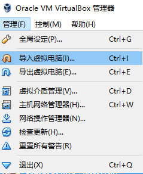
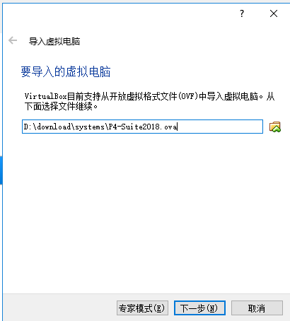
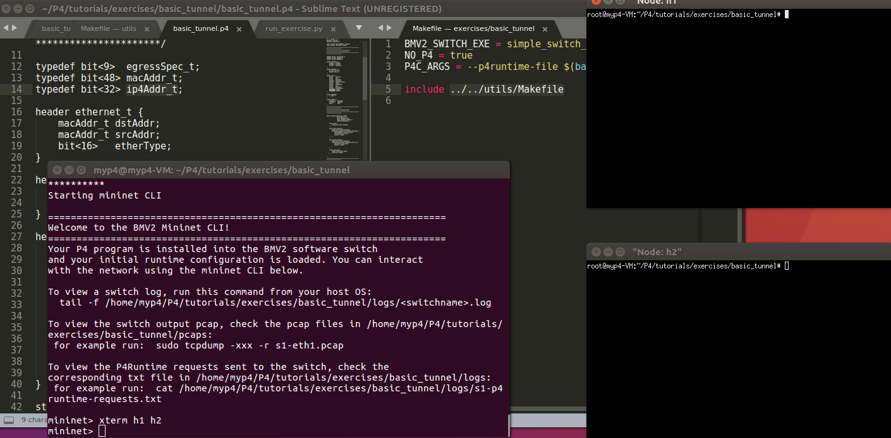
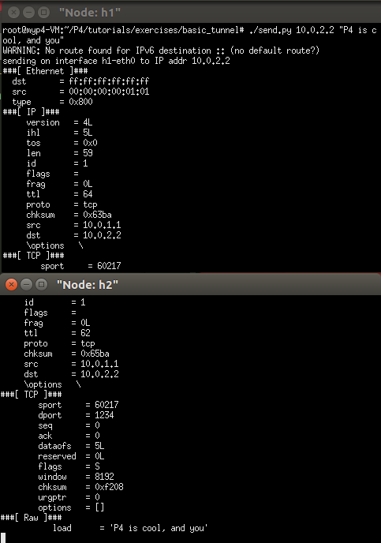
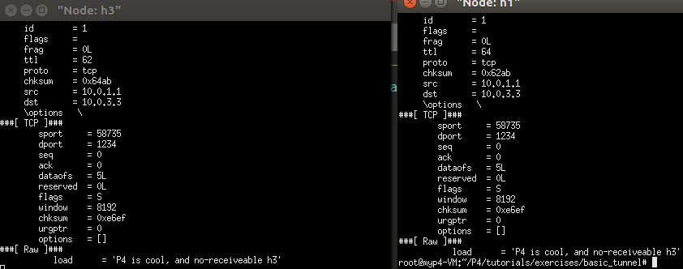
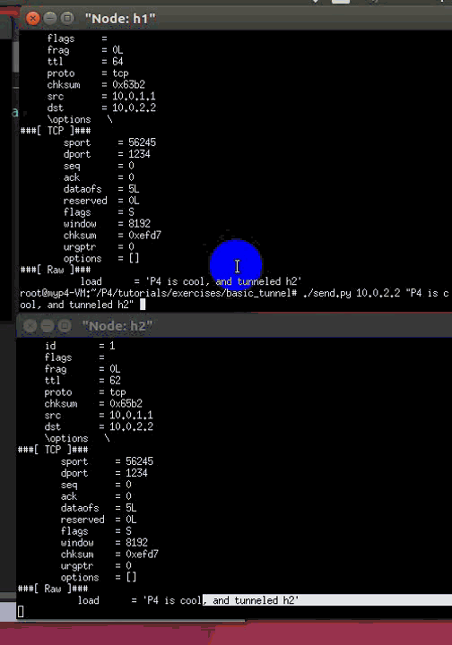
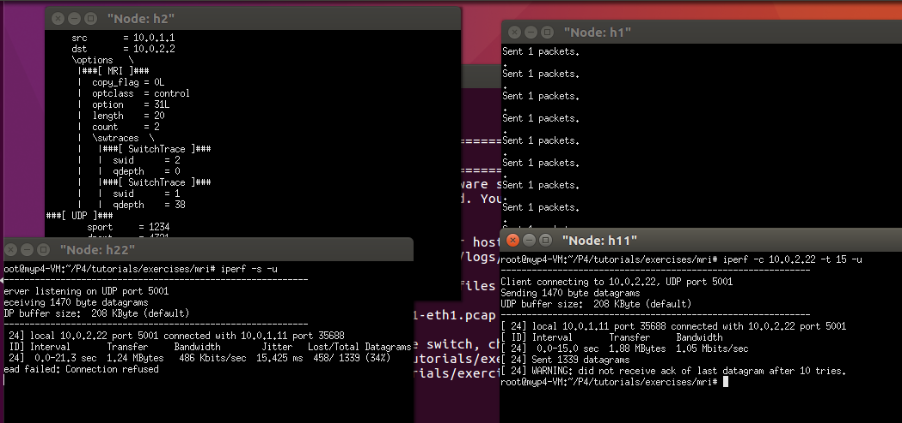

# P4 Tutorial

可以直接跳到下方中文部分

## Introduction

Welcome to the P4 Tutorial! We've prepared a set of exercises to help
you get started with P4 programming, organized into several modules:

1. Introduction and Language Basics
* [Basic Forwarding](./exercises/basic)
* [Basic Tunneling](./exercises/basic_tunnel)

2. P4Runtime and the Control Plane
* [P4Runtime](./exercises/p4runtime)

3. Monitoring and Debugging
* [Explicit Congestion Notification](./exercises/ecn)
* [Multi-Hop Route Inspection](./exercises/mri)

4. Advanced Behavior
* [Source Routing](./exercises/source_routing)
* [Calculator](./exercises/calc)
* [Load Balancing](./exercises/load_balance)


# 中文部分by tt


p4_steps.md

[TOC]

# install

建议直接使用ova


## 使用微云里的ova 虚拟机导入vbox，直接可用


link： https://share.weiyun.com/5q791LD






# 一些实例

参考： https://github.com/p4lang/tutorials

## 内容有：

1. Introduction and Language Basics
- Basic Forwarding
- Basic Tunneling
2. P4Runtime and the Control Plane
- P4Runtime
3. Monitoring and Debugging
- Explicit Congestion Notification
- Multi-Hop Route Inspection
4. Advanced Behavior
- Source Routing
- Calculator
- Load Balancing


# 实践

## 实践basic tunneling

ps： 所有步骤可以参考 tutorial ：

https://github.com/p4lang/tutorials/tree/master/exercises/basic_tunnel



- In h2's xterm, start the server:`bash ./receive.py`
- 然后，首先测试 without tunneling: 在h1 使用：`./send.py 10.0.2.2 "P4 is cool, and you" `




没有启动h3的receive 的时候，h1 可以发送，当然没错，开启了h3的xterm 终端，并开启receive.py，如下：



## 接下来测试带有我们自己tunnel tag 的报文

- h1 send  h2 ：  `./send.py 10.0.2.2 "P4 is cool" --dst_id 2`


- h1 send to h2 by send to h3 :  `./send.py 10.0.3.3 "P4 is cool" --dst_id 2`


## 实践 load balance

数据中心内负载均衡-ECMP的使用分析: https://www.sdnlab.com/20605.html

### ECMP(Equal-cost multi-path)

ECMP是一个逐跳的基于流的负载均衡策略，当路由器发现同一目的地址出现多个最优路径时，会更新路由表，为此目的地址添加多条规则，对应于多个下一跳。

#### ECMP的路径选择策略有多种方法：

- 哈希，例如根据源IP地址的哈希为流选择路径。
- 轮询，各个流在多条路径之间轮询传输。
- 基于路径权重，根据路径的权重分配流，权重大的路径分配的流数量更多。

### 视频结果：

see: assets/Video_2019-01-14_114934.mp4

<video id="video" controls="" preload="none" poster="assets/README-19506be2.png">
      <source id="mp4" src="assets/Video_2019-01-14_114934.mp4" type="video/mp4">
      </video>

可以从下方的gif 中，发现仅仅只有2.2（h2） 收到了h1 对0.1 的请求， h3 并没有进行 LB


---

 接下来，我们使用solution 里面的p4 源代码看看。


一套命令如下：


```
make run
xterm h1 h2 h3
./send.py 10.0.0.1 "your text like: p4 is cool"
make stop
make clean
```


从上图可以看到，多次进行h1 上面的send  到 10.0.0.1 ,报文有时候均衡到h2 ， 有时候 均衡 到 h3 .


## 实践 mri

Multi-Hop Route Inspection （MRI）


表面上的结果就是 h2 会收到那些pkt ，但是这些pkt 的optioin 字段里没有 路径 信息，也就是说 ： 你会看到`count=0`


---

使用solution的答案 之后， 可以看到IP 头部的option 部分有了MRI 的信息


### iperf


iperf是一个网络性能测试工具，能够测量TCP和UDP的带宽。



## 实践 source_routing

- [ ] TODO 0114

看了一遍，source route：

ip source routing 提供的功能是记录报文经过的路径，并期望报文经由该路径返回
