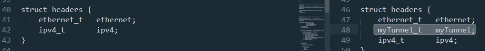
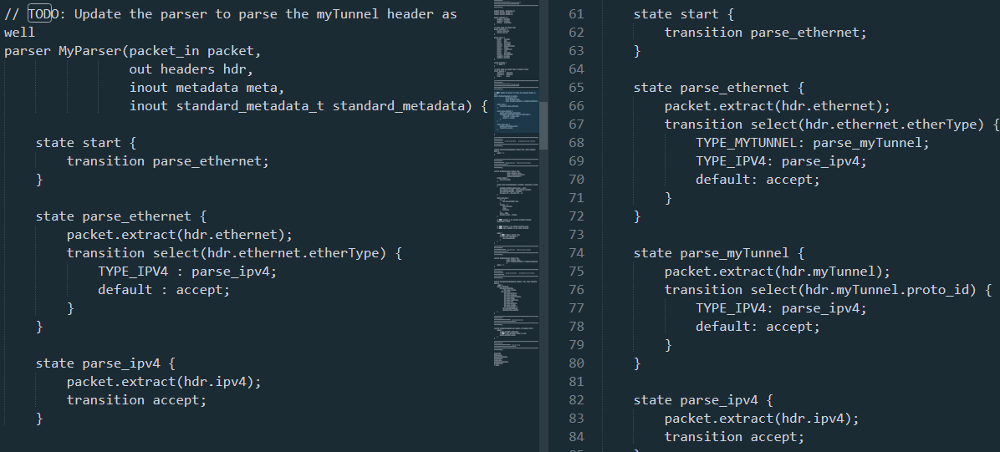
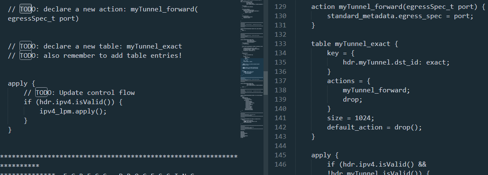
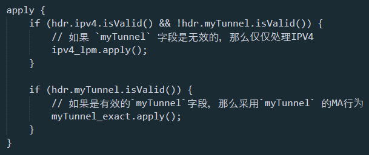
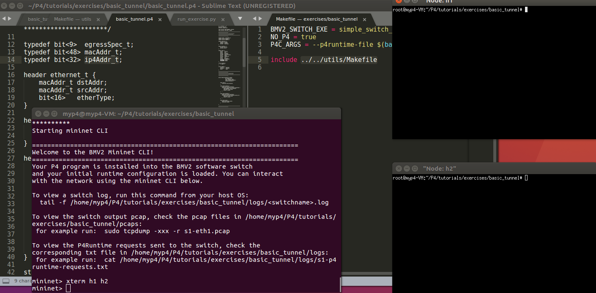
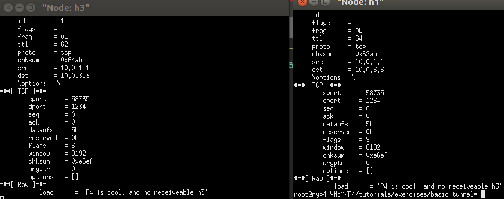

[TOC]


# 实践basic tunneling

 这个实验期待什么样的结果：在网络中， 带有`myTunnel` 标记的报文，可以获得比IPv4 标记（地址，身份）更高的传送优先级。

 比如：

 我希望： 通过通道标记`myTunnel` 实际对应的值 ：dst_id =2  到达 host 2。

但是 报文的IP标记`ipv4`, 实际对应的值 是host 3 的IP

即便如此，我们可以看到实现了 basic tunneling 的虚拟交换机 可以通过 host 3 寻址 到host 2.

你需要完成的是：

1. 新的报文头部增加 `myTunnel` 字段，

2. 需要在parser 里添加一个能解析此`myTunnel` 字段的 状态。

3.  完善ingress，以至于我们能在入口流水线处理 `myTunnel` 字段 的MA

4. 令一个MA 生效的方式是 apply 这个策略


接下来我将展示，完善`前 / 后`的交换机表现出来的现象


ps： 所有步骤可以参考 tutorial ：

https://github.com/p4lang/tutorials/tree/master/exercises/basic_tunnel


## 完善前的交换机表现出来的现象

现象是host3 拿到了 去往host 2 的报文，也就是说没有完成 tunnel 功能。



- In h2's xterm, start the server:`bash ./receive.py`
- 然后，首先测试 without tunneling: 在h1 使用：`./send.py 10.0.2.2 "P4 is cool, and you" `


没有启动h3的receive 的时候，h1 可以发送给h3，这当然没错，只不过没有打开h3看看接收的内容

开启了h3的xterm 终端，并开启`receive.py`，h1 发送给h3 ，如下：



## 完善后的交换机表现出来的现象

接下来测试带有我们自己tunnel tag 的报文

### 首先是 带着通道标签 dst == 2， 目的ip 也是 h2 的

下面的 gif 图告诉我们，h2一定可以收到

- h1 send  h2 ：  `./send.py 10.0.2.2 "P4 is cool" --dst_id 2`


### 然后是  带着通道标签 dst == 2， 目的ip 却是 h3 的

下面的 gif 图告诉我们，h2也是可以收到的

- h1 send to h2 by send to h3 :  `./send.py 10.0.3.3 "P4 is cool" --dst_id 2`

gif 图是最顶层的assets/p4_runtime_intro-91acc7fe.gif


# 以下是英文原文指导

# Implementing Basic Tunneling

## Introduction

In this exercise, we will add support for a basic tunneling protocol to the IP
router that you completed in the previous assignment.  The basic switch
forwards based on the destination IP address.  Your jobs is to define a new
header type to encapsulate the IP packet and modify the switch code, so that it
instead decides the destination port using a new tunnel header.

The new header type will contain a protocol ID, which indicates the type of
packet being encapsulated, along with a destination ID to be used for routing.


> **Spoiler alert:** There is a reference solution in the `solution`
> sub-directory. Feel free to compare your implementation to the reference.

The starter code for this assignment is in a file called `basic_tunnel.p4` and
is simply the solution to the IP router from the previous exercise.


### A note about the control plane

A P4 program defines a packet-processing pipeline, but the rules within each
table are inserted by the control plane. When a rule matches a packet, its
action is invoked with parameters supplied by the control plane as part of the
rule.

也就是说： control panel 会进行表项的下发，下发的具体 的 内容有：

`table_name`
`one_action_in_this_table`  比如找到一个匹配的src IP key，然后跳转到寻找dst IP 的对应mac 的 `action` 里
`one_key_will_trigger_this_action` 比如IP 值
`any_useful_data_this_action_need` 比如IP key 是`10.2.3.4`的下一跳ptr值 say: `12`

For this exercise, we have already added the necessary static control plane
entries. As part of bringing up the Mininet instance, the `make run` command
will install packet-processing rules in the tables of each switch. These are
defined in the `sX-runtime.json` files, where `X` corresponds to the switch
number.

Since the control plane tries to access the `myTunnel_exact` table, and that
table does not yet exist, the `make run` command will not work with the starter
code.

**Important:** We use P4Runtime to install the control plane rules. The content
of files `sX-runtime.json` refer to specific names of tables, keys, and
actions, as defined in the P4Info file produced by the compiler (look for the
file `build/basic.p4info` after executing `make run`). Any changes in the P4
program that add or rename tables, keys, or actions will need to be reflected
in these `sX-runtime.json` files.

## Step 2: Implement Basic Tunneling

The `basic_tunnel.p4` file contains an implementation of a basic IP router.  It
also contains comments marked with `TODO` which indicate the functionality that
you need to implement. A complete implementation of the `basic_tunnel.p4`
switch will be able to forward based on the contents of a custom encapsulation
header as well as perform normal IP forwarding if the encapsulation header does
not exist in the packet.

Your job will be to do the following:

1. **NOTE:** A new header type has been added called `myTunnel_t` that contains
two 16-bit fields: `proto_id` and `dst_id`.
2. **NOTE:** The `myTunnel_t` header has been added to the `headers` struct.
2. **TODO:** Update the parser to extract either the `myTunnel` header or
`ipv4` header based on the `etherType` field in the Ethernet header. The
etherType corresponding to the myTunnel header is `0x1212`. The parser should
also extract the `ipv4` header after the `myTunnel` header if `proto_id` ==
`TYPE_IPV4` (i.e.  0x0800).
3. **TODO:** Define a new action called `myTunnel_forward` that simply sets the
egress port (i.e. `egress_spec` field of the `standard_metadata` bus) to the
port number provided by the control plane.
4. **TODO:** Define a new table called `myTunnel_exact` that perfoms an exact
match on the `dst_id` field of the `myTunnel` header. This table should invoke
either the `myTunnel_forward` action if the there is a match in the table and
it should invoke the `drop` action otherwise.
5. **TODO:** Update the `apply` statement in the `MyIngress` control block to
apply your newly defined `myTunnel_exact` table if the `myTunnel` header is
valid. Otherwise, invoke the `ipv4_lpm` table if the `ipv4` header is valid.
6. **TODO:** Update the deparser to emit the `ethernet`, then `myTunnel`, then
`ipv4` headers. Remember that the deparser will only emit a header if it is
valid. A header's implicit validity bit is set by the parser upon extraction.
So there is no need to check header validity here.
7. **TODO:** Add static rules for your newly defined table so that the switches
will forward correctly for each possible value of `dst_id`. See the diagram
below for the topology's port configuration as well as how we will assign IDs
to hosts. For this step you will need to add your forwarding rules to the
`sX-runtime.json` files.


## Step 3: Run your solution

1. In your shell, run: ```bash make run ``` This will:
   * compile `basic_tunnel.p4`, and
   * start a Mininet instance with three switches (`s1`, `s2`, `s3`) configured
     in a triangle, each connected to one host (`h1`, `h2`, and `h3`).
   * The hosts are assigned IPs of `10.0.1.1`, `10.0.2.2`, and `10.0.3.3`.

2. You should now see a Mininet command prompt. Open two terminals for `h1` and
`h2`, respectively: ```bash mininet> xterm h1 h2 ```
3. Each host includes a small Python-based messaging client and server. In
`h2`'s xterm, start the server: ```bash ./receive.py ```
4. First we will test without tunneling. In `h1`'s xterm, send a message to
`h2`: ```bash ./send.py 10.0.2.2 "P4 is cool" ``` The packet should be received
at `h2`. If you examine the received packet you should see that is consists of
an Ethernet header, an IP header, a TCP header, and the message. If you change
the destination IP address (e.g. try to send to `10.0.3.3`) then the message
should not be received by h2, and will instead be received by h3.
5. Now we test with tunneling. In `h1`'s xterm, send a message to `h2`: ```bash
./send.py 10.0.2.2 "P4 is cool" --dst_id 2``` The packet should be received at
`h2`. If you examine the received packet you should see that is consists of an
Ethernet header, a tunnel header, an IP header, a TCP header, and the message.
6. In `h1`'s xterm, send a message: ```bash ./send.py 10.0.3.3 "P4 is cool"
--dst_id 2``` The packet should be received at `h2`, even though that ip
address is the address of `h3`. This is because the switch is no longer using
the IP header for routing when the `MyTunnel` header is in the packet.
7. Type `exit` or `Ctrl-D` to leave each xterm and the Mininet command line.


> Python Scapy does not natively support the `myTunnel` header type so we have
> provided a file called `myTunnel_header.py` which adds support to Scapy for
> our new custom header. Feel free to inspect this file if you are interested
> in learning how to do this.

### Food for thought

To make this tunneling exercise a bit more interesting (and realistic) how
might you change the P4 code to have the switches add the `myTunnel` header to
an IP packet upon ingress to the network and then remove the `myTunnel` header
as the packet leaves to the network to an end host?

Hints:

 - The ingress switch will need to map the destination IP address to the
   corresponding `dst_id` for the `myTunnel` header. Also, remember to set the
validity bit for the `myTunnel` header so that it can be emitted by the
deparser.
 - The egress switch will need to remove the `myTunnel` header from the packet
   after looking up the appropriate output port using the `dst_id` field.

### Troubleshooting

There are several problems that might manifest as you develop your program:

1. `basic_tunnel.p4` might fail to compile. In this case, `make run` will
report the error emitted from the compiler and halt.

2. `basic_tunnel.p4` might compile but fail to support the control plane rules
in the `sX-runtime.json` files that `make run` tries to install using the
P4Runtime. In this case, `make run` will report errors if control plane rules
cannot be installed. Use these error messages to fix your `basic_tunnel.p4`
implementation or forwarding rules.

3. `basic_tunnel.p4` might compile, and the control plane rules might be
installed, but the switch might not process packets in the desired way. The
`/tmp/p4s.<switch-name>.log` files contain detailed logs that describing how
each switch processes each packet. The output is detailed and can help pinpoint
logic errors in your implementation.

#### Cleaning up Mininet

In the latter two cases above, `make` may leave a Mininet instance running in
the background. Use the following command to clean up these instances:

```bash make stop ```

## Next Steps

Congratulations, your implementation works! Move onto the next assignment
[p4runtime](../p4runtime)!
